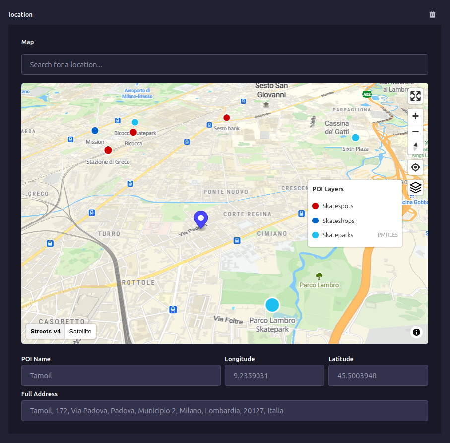

# MapLibre Field - Strapi v5 Plugin

[](https://www.npmjs.com/package/@premiate/strapi-plugin-maplibre-field)
[](LICENSE)
[](https://strapi.io)

A [Strapi](https://strapi.io/) plugin providing a [MapLibre](https://www.maplibre.org/) map custom field with POI support, geocoding and multi base maps.



## ✨ Key Features

- **Interactive MapLibre GL map** with smooth zoom and pan
- **Multiple basemap styles** support (MapTiler, Stadia, PMTiles, custom)
- **OpenStreetMap geocoding** via Nominatim (forward & reverse)
- **Custom POI layers** with GeoJSON API integration
- **Layer control panel** for toggling POI sources
- **GeoJSON Feature** storage (RFC 7946 compliant)
- **TypeScript** support with full type definitions

## 📦 Installation

### Requirements

- Strapi v5.0.0 or higher
- Node.js 20.0.0 or higher

### Install

```bash
# Using npm
npm install @premiate/strapi-plugin-maplibre-field

# Using Yarn
yarn add @premiate/strapi-plugin-maplibre-field
```

## ⚙️ Quick Strapi Setup

### 1. Enable the plugin

Create or update `config/plugins.ts`:

```typescript
export default {
  "maplibre-field": {
    enabled: true,
    config: {
      mapStyles: [
        {
          id: "osm",
          name: "OpenStreetMap",
          url: "https://demotiles.maplibre.org/style.json",
          isDefault: true,
        },
      ],
      defaultCenter: [9.19, 45.46], // [longitude, latitude]
      defaultZoom: 13,
    },
  },
};
```

### 2. Update security middleware

Open `config/middlewares.ts` and add `'worker-src': ['blob:']`:

```typescript
export default [
  "strapi::errors",
  {
    name: "strapi::security",
    config: {
      contentSecurityPolicy: {
        useDefaults: true,
        directives: {
          "connect-src": ["'self'", "https:"],
          "img-src": ["'self'", "data:", "blob:"],
          "worker-src": ["blob:"], // Required for MapLibre
          upgradeInsecureRequests: null,
        },
      },
    },
  },
  // ... other middlewares
];
```

### 3. Add map field to content type

In the Strapi Content-Type Builder pick up your Collection Type, Single Type or Component and:

1. Click **Add another field**
2. Select the **Custom** tab
3. Select the **Map** field
4. Type a name for the field
5. Click **Finish**


## 🎯 How to Select a Location

There are multiple ways to select a location:

- **Search box** - Type an address or place name
- **Click POI marker** - Select pre-defined points of interest
- **Double-click map** - Place marker at exact coordinates

The selected location is saved as a GeoJSON Feature with coordinates, name, address, and metadata.

## 📚 Documentation

- **[Configuration Guide](docs/CONFIGURATION.md)** - Map styles, geocoding, POI setup, all options
- **[Usage Guide](docs/USAGE.md)** - Adding fields, selecting locations, localization
- **[POI Integration](docs/POI.md)** - Custom POI sources, layer control, GeoJSON API
- **[Data Model](docs/DATA-MODEL.md)** - GeoJSON structure, properties reference

## 🗺️ Map Providers

The plugin supports any [MapLibre Style Specification](https://maplibre.org/maplibre-style-spec/) compatible provider:

- **MapLibre Demo Tiles** - Free, public, no API key required (setup as fallback if no configuration available)
- **MapTiler** - Requires API key, multiple styles available
- **Stadia Maps** - Requires API key, OSM-based styles
- **PMTiles** - Self-hosted tiles, no tile server required
- **Custom styles** - Create your own with [Maputnik](https://maputnik.github.io/)

See the [Configuration Guide](docs/CONFIGURATION.md) for detailed setup instructions.

## 🏢 POI Support

Integrate custom Points of Interest from your own GeoJSON API:

- Display POI markers on the map
- Click to select and save complete POI data
- Layer control to toggle multiple POI sources
- Search integration (queries both Nominatim and custom APIs)
- Configurable zoom levels and display limits

See the [POI Integration Guide](docs/POI.md) for setup and examples.

## 🔧 Data Structure

Locations are stored as GeoJSON Features:

```json
{
  "type": "Feature",
  "geometry": {
    "type": "Point",
    "coordinates": [9.1901, 45.4601]
  },
  "properties": {
    "name": "Piazza Velasca",
    "address": "Piazza Velasca, Milano, 20122, Italia",
    "source": "nominatim",
    "category": "bus_stop",
    "inputMethod": "search"
  }
}
```

See the [Data Model Guide](docs/DATA-MODEL.md) for complete property reference.

## 🤝 Contributing

Bug reports and pull requests are welcome on [GitHub](https://github.com/Premiate-Edizioni/strapi-plugin-maplibre-field).

See [CONTRIBUTING.md](CONTRIBUTING.md) for development setup and guidelines.

## 📝 Credits

This plugin was forked from [strapi-plugin-map-field](https://github.com/play14team/strapi-plugin-map-field) by Cédric Pontet and migrated from Mapbox to MapLibre with foundations on OpenStreetMap, Nominatim geocoding, and Protomaps.

Thanks to [Enzo Brunii](https://github.com/enzobrunii) for initial contributions.

## 📄 License

[MIT](LICENSE) © Claudio Bernardini / Dipartimento di Cartografia Esistenzialista in Fotta, Premiate Edizioni
