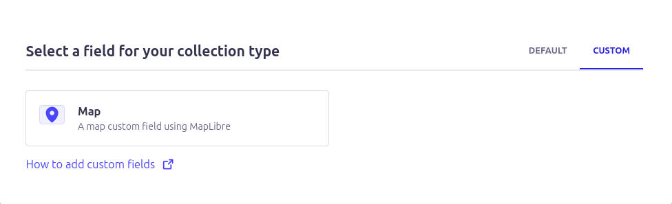

# Usage Guide

How to use the MapLibre Field in your Strapi content types.

## Table of Contents

- [Adding a Map Field](#adding-a-map-field)
- [Selecting Locations](#selecting-locations)
- [Editing Locations](#editing-locations)
- [Localization (i18n)](#localization-i18n)
- [Layer Control](#layer-control)
- [Best Practices](#best-practices)

## Adding a Map Field

### Via Content-Type Builder UI

1. Open the **Content-Type Builder** in your Strapi admin panel
2. Select the content type you want to add a map field to (or create a new one)
3. Click **Add another field**
4. Select the **Custom** tab
5. Click on the **Map** field
6. Enter a **Name** for your field (e.g., `location`, `address`, `coordinates`)
7. Click **Finish**
8. **Save** the content type



### Via Schema Definition

You can also add the field programmatically by editing your content type's schema:

```json
{
  "kind": "collectionType",
  "collectionName": "articles",
  "info": {
    "singularName": "article",
    "pluralName": "articles",
    "displayName": "Article"
  },
  "attributes": {
    "title": {
      "type": "string"
    },
    "location": {
      "type": "customField",
      "customField": "plugin::maplibre-field.map"
    }
  }
}
```

**Note**: After manually editing schema files, restart Strapi for changes to take effect.

## Selecting Locations

There are three ways to select a location on the map:

### 1. Using the Search Box

The easiest way to find and select a location:

1. Type an address or place name in the **search box** at the top of the map
2. Select a result from the dropdown
3. The map will zoom to the location and place a marker
4. The location data (name, address, coordinates) is automatically saved

**What's saved**:
- Place name
- Full formatted address
- Coordinates (latitude, longitude)
- POI category (if applicable)
- Source: "nominatim"

**Example searches**:
- "Piazza del Duomo, Milano"
- "Eiffel Tower"
- "123 Main Street, New York"
- "Central Park"

### 2. Clicking on a POI Marker

If custom POI layers are configured (see [POI Integration](POI.md)), you can click directly on POI markers:

1. Zoom into an area with POI markers (they appear at zoom level 10+)
2. Click on any **POI marker** (colored pins on the map)
3. The marker turns **orange** when selected
4. Complete POI data is saved automatically

**What's saved**:
- POI name
- POI category/type
- Full address (via reverse geocoding)
- Coordinates
- Custom metadata from your API
- Source: your custom API identifier

**Visual feedback**:
- Selected POI marker turns orange (#ff5200)
- Success notification shows POI name
- Readonly fields display coordinates and address

### 3. Double-Clicking on the Map

For precise coordinate selection or when no POI exists:

1. **Zoom in** to the desired location (higher zoom = more precision)
2. **Double-click** anywhere on the map

**Two behaviors based on proximity**:

**A) Near a POI (within snap radius - default 5 meters)**:
- Automatically selects the nearest POI
- Saves complete POI data (same as clicking the POI marker)
- Notification shows: "POI Name (distance)"
- Example: "Skatepark Milano (3m)"

**B) Far from any POI**:
- Places marker at exact click coordinates
- Saves **only coordinates** (no name or address)
- Useful for marking locations without existing POI data
- Notification shows: "Location saved (coordinates only)"

**What's saved** (coordinates-only mode):
```json
{
  "type": "Feature",
  "geometry": {
    "type": "Point",
    "coordinates": [9.190252, 45.459891]
  },
  "properties": {
    "inputMethod": "map_click"
  }
}
```

**Tip**: The snap radius is configurable in plugin settings (`poiSnapRadius` option, default: 5 meters).

## Editing Locations

### Changing a Location

Simply select a new location using any of the three methods above. The new location data will replace the existing data.

### Clearing a Location

1. Click the map field to open it
2. The field will show as empty if no location is set
3. To clear an existing location, you can:
   - Delete the content in the readonly coordinate fields (if exposed)
   - Or use the Strapi content editor to clear the entire field value

### Readonly Fields

Below the map, you'll see readonly fields displaying:

- **Longitude**: The X coordinate (-180 to 180)
- **Latitude**: The Y coordinate (-90 to 90)
- **Address**: Full formatted address (if available)

These fields are for reference only and cannot be edited directly. To change values, select a new location on the map.

## Localization (i18n)

By default, **localization is disabled** for map fields because geographic coordinates are universal and don't vary by language.

### When to Enable Localization

Enable localization only if you need **different physical locations** per language. For example:

- Multiple office addresses in different countries
- Regional event locations
- Language-specific store locations

### How to Enable Localization

1. In the Content-Type Builder, select your content type
2. Click on the map field to edit it
3. Go to the **Advanced Settings** tab
4. Check **"Enable localization for this field"**
5. Save the content type

Now each language version of your content can have a different location.

### Important Notes

- **Addresses automatically translate**: When using Nominatim geocoding, addresses are returned in the local language of the region
- **Coordinates don't change**: If the same physical location applies to all languages, keep localization disabled
- **Don't use for translations**: Localization is for different physical locations, not for translating the same location's name/address

## Layer Control

When multiple POI sources are configured, a **layer control panel** appears on the map.

### Using Layer Control

The layer control lets you toggle POI layers on and off:

1. Look for the **layer icon** (usually in the top-right of the map)
2. Click to open the layer control panel
3. Each POI source has an **colored dot** next to its name
4. Click the dot icon to show/hide that layer's POI markers

### Features

- **Real-time updates**: POIs appear/disappear immediately when toggling
- **Independent control**: Each layer can be toggled separately
- **Persistent state**: Layer visibility is remembered during your session
- **Dynamic loading**: When moving the map, POIs are fetched only for visible layers

### Example Use Cases

**Skateparks and Skateshops**:
- Show both layers when planning a skate trip
- Hide skateshops to focus only on parks
- Show only shops when looking for gear

**Multiple Categories**:
- Museums, restaurants, and hotels
- Toggle based on current planning need
- Reduce visual clutter by hiding unused categories

## Best Practices

### For Content Editors

**1. Use Search for Known Places**
- Fastest method for well-known addresses and landmarks
- Ensures accurate geocoding and address formatting
- Automatically includes POI category when available

**2. Use POI Click for Pre-defined Locations**
- When the location is already in your custom POI database
- Ensures consistency across content entries
- Includes all custom metadata from your API

**3. Use Double-Click for Precise Coordinates**
- When no POI exists at the exact location
- For marking temporary or unofficial spots
- When you need precise positioning (e.g., photo locations)

**4. Zoom In Before Selecting**
- Higher zoom = more precision
- At high zoom, double-clicking can snap to small POIs (shops, cafes)
- At low zoom, you might miss small POI targets

**5. Verify the Address**
- Always check the readonly address field after selection
- Geocoding may return unexpected results for ambiguous searches
- Re-search with more specific terms if needed

### For Administrators

**1. Configure Appropriate Zoom Levels**
- Set `defaultZoom` based on your typical use case
- City-level: 10-12
- Neighborhood: 13-15
- Street-level: 16-18

**2. Optimize POI Display**
- Set `poiMinZoom` high enough to prevent clutter (10-12 recommended)
- Limit `poiMaxDisplay` based on POI density (50-200 typical)
- Use descriptive `name` values in `poiSources` for clarity

**3. Choose Appropriate Map Styles**
- Satellite: Best for outdoor locations, parks, terrain
- Streets: Best for addresses, urban navigation
- Outdoor: Best for hiking, natural features

**4. Test Geocoding Performance**
- Use self-hosted Nominatim for production (avoid public server limits)
- Monitor geocoding response times
- Consider caching frequently searched locations

**5. Provide User Guidance**
- Add field descriptions in the Content-Type Builder
- Document your specific POI sources and categories
- Create internal guides for content editors

### Common Issues and Solutions

**Problem**: Map doesn't display / shows white box

**Solution**: Check that you've updated the security middleware with `worker-src: ["blob:"]`. See [Configuration Guide](CONFIGURATION.md#security-middleware).

---

**Problem**: POI markers don't appear

**Solutions**:
- Check that you're zoomed in enough (`poiMinZoom` setting)
- Verify layer is enabled in layer control
- Check browser console for API errors
- Verify your POI API returns valid GeoJSON

---

**Problem**: Search returns no results

**Solutions**:
- Be more specific in your search (add city/country)
- Check Nominatim service is accessible
- Try different search terms (address vs place name)
- Verify internet connection

---

**Problem**: Double-click doesn't select nearby POI

**Solutions**:
- Zoom in closer (POIs must be visible)
- Check if you're within snap radius (default 5m, configurable)
- Ensure POI layer is enabled
- Click directly on POI marker instead

---

**Problem**: Wrong address displayed

**Solutions**:
- Nominatim uses OpenStreetMap data which may be incomplete
- Try clicking a different nearby location
- Manually verify the coordinates are correct
- Consider using a different geocoding provider for your region
